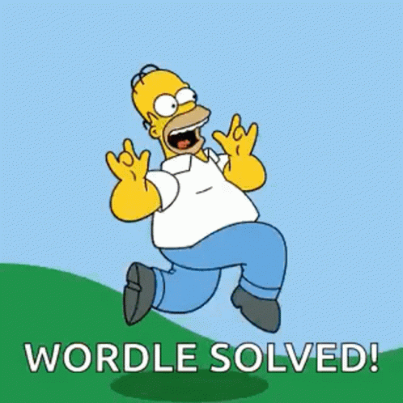

⚠️ Este é um projeto de cunho educacional, desenvolvido para o <a href="https://7daysofcode.io/">**7 Days of Code da Alura**</a>  pela instrutora <a href="https://github.com/laisfrigerio"> Lais Frigério </a>.

# 7 Days of Code - Alura: JavaScript e DOM

## Objetivo

Construir sua versão do jogo Wordle. O Wordle é um jogo de palavras em que o objetivo é adivinhar a palavra escondida. A palavra tem 5 letras e você pode fazer até 6 palpites.

## Desafio

Construir esta aplicação utilizando HTML, CSS e JavaScript puro a partir do <a href="https://www.figma.com/file/bKKIv0BSdVrzlMG79phJop/7DaysofCode---Wordle?type=design&node-id=0%3A1&mode=design&t=IuS9uLemzSCa83T1-1">Figma</a> disponibilizado.  

**Tecnologias**
- HTML
- CSS
- JavaScript
- Jest

### Dia 1

Dar o início ao desenvolvimento do seu jogo: construir a sua página com base no layout proposto. 

 

**Objetivo**
 
Criar a estrutura HTML da página e aplicar os estilos de CSS.

### Dia 2

Dar início ao desenvolvimento de funcionalidades usando JavaScript. Além do mais, escrever testes automatizados com o objetivo de deixar o seu projeto com uma alta cobertura de testes.

 

**Objetivo**
 
- Criar a função responsável por escolher randomicamente a palavra que será adivinhada no jogo.
- Escrever testes de unidade para esta função, utilizando Jest e criando mocks.
